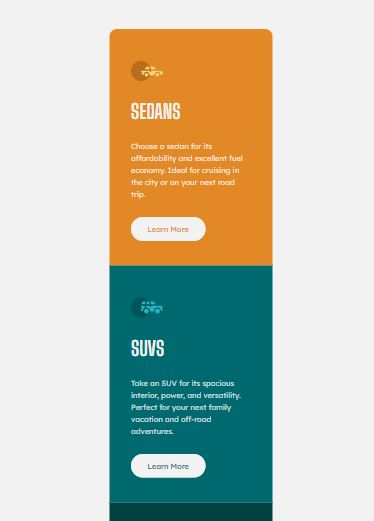
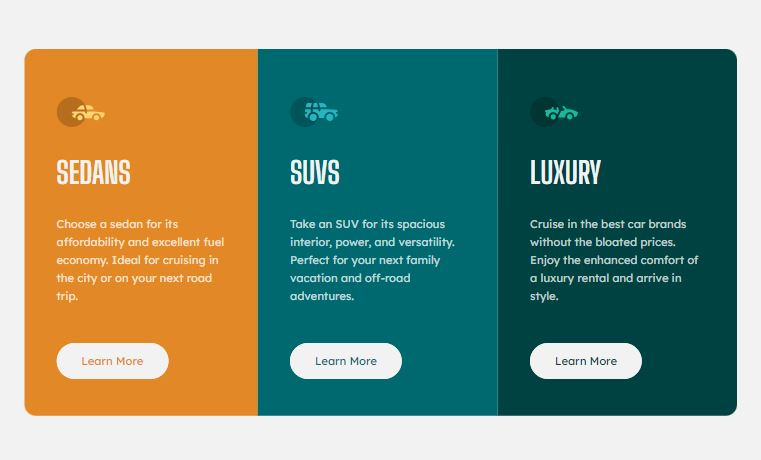

# Frontend Mentor - 3-column preview card component solution

This is a solution to the [3-column preview card component challenge on Frontend Mentor](https://www.frontendmentor.io/challenges/3column-preview-card-component-pH92eAR2-). 
Frontend Mentor challenges help you improve your coding skills by building realistic projects.

## Table of contents

- [Overview](#overview)
  - [The challenge](#the-challenge)
  - [Screenshot](#screenshot)
  - [Links](#links)
- [My process](#my-process)
  - [Built with](#built-with)
  - [Continued development](#continued-development)
  - [Useful resources](#useful-resources)
- [Author](#author)

## Overview

### The challenge

Users should be able to:

- View the optimal layout depending on their device's screen size
- See hover states for interactive elements

### Screenshot

#### Mobile

#### Desktop

### Links

- [Solution URL](https://www.frontendmentor.io/solutions/card-component-built-with-html-sass-and-bem-Q-AxmA9QMi)
- [Live site URL here](https://guisantosfr.github.io/3-column-preview-card-component/)

## My process

### Built with

- HTML5
- SASS (SCSS sintax)
- Mobile-first workflow
- [BEM](https://getbem.com/) - CSS naming convention

### Continued development

In future projects, i'd like to explore others CSS conventions (SMACSS, ITCSS, etc).

### Useful resources

- [Dev Docs](https://devdocs.io) - API for multiple documentations

## Author

- Frontend Mentor - [@guisantosfr](https://www.frontendmentor.io/profile/guisantosfr)
- Linkedin - [Francisco Guilherme](https://www.linkedin.com/in/guisantosfr/)
